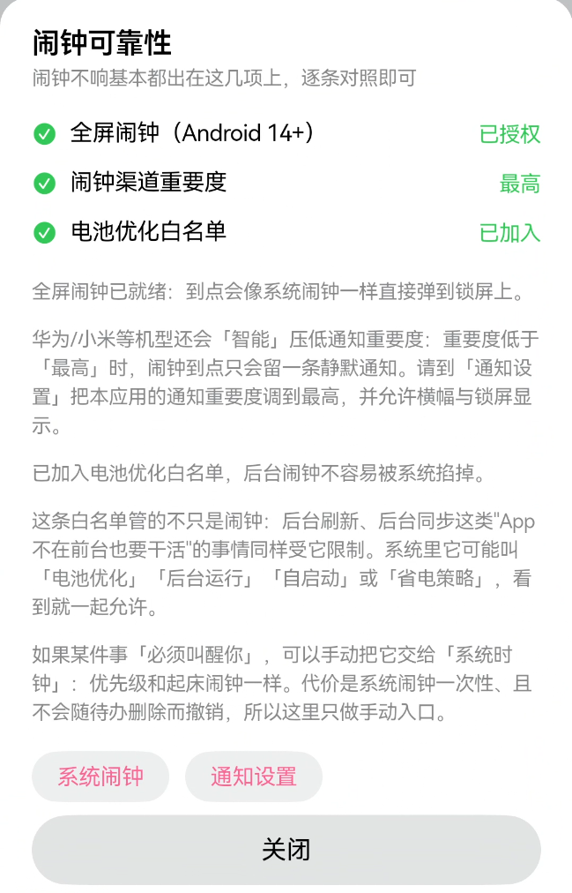
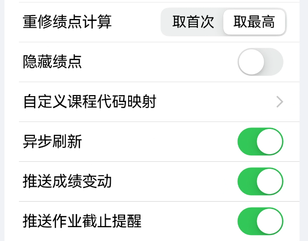
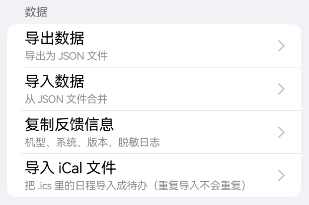

 > 本文档用于记录人工写入的教程，用于给 AI 写入正式程序
 > 所有图片使用【图片内容】标识。请接手本文档的 AI 自行截图并剪裁到合适的尺寸，嵌入文本
 > 具体格式：1. 2. 3. 等小数字序号标识页数，一、二、三、等大数字标识教程数
 > 全软件不支持 markdown 格式渲染。本文档的加粗符号标识教程页面的标题，（）内包含对接手本文档的 AI 的提示

 # 零、配置相关

 1. **配置环境**
 想要把Elychron变得更加顺手，使用前请注意更改几个设置。
 当然这些设置不是必须的，但是Elychron强烈建议跟着操作一遍！
 2. **DeepSeek密钥配置**
 这是使用Elychron核心功能的必要条件。据传Tixer最喜欢的就是这个功能。
 蓝色大肥鱼的API key配置方法并不复杂，懂的可以跳过。
 第一步，访问DeepSeek官方网站，点击API开放平台。
 【图片】（这个图片你看得到吗？）
 在左侧工具栏点击API keys，随后点击页面右侧的黑色按键 创建API key
 
 在弹窗内输入API key的名字（随意就好），点击创建。
 请仔细保存好这个key！复制后直接粘贴到Elychron的设置-AI智能助手页面的API key里面。
 注意，直接复制粘贴可能会不成功，建议先在便签之类的地方中转一次再粘贴。
 最后不要忘了给DeepSeek打钱
 
 3. **闹钟相关设置**
 由于Elychron不是系统应用，很多闹钟功能无法复现。
 但是为了尽可能保持稳定性，可以进入设置-闹钟可靠性选项，按说明操作。
 
 不过很可惜，按照操作之后还是有很多功能会被拦截……
 4. **其他优化**
 首先非常建议开启异步刷新。这样做的意义是可以同时尝试连接多个相关网站，减少登录延迟
 
 然后，如果有问题想要反馈，建议附上设置内复制反馈信息功能的反馈日志，便于定位问题所在
 
 5. **继续看教程吧**
 除了基础配置，Elychron强烈建议看的教程还有“基本操作”。
 其他教程看个人需求就可以啦，欢迎来到Elychron！

 #  一、基本操作

 1. **掌握基本操作** 
 在使用 Elychron 的过程中，许多操作不是通过文字引导的按键实现的。掌握这些手势可以更方便地执行操作，熟练之后能够极大程度提升操作效率
 2. **待办的完成、删除与恢复**
 在待办页面，我们可以用三种手势对待办进行操作。
 当待办未完成时右滑待办，可以直接完成
 【图片】（尽量展示划到一半，露出两种颜色）
 左滑待办，可以直接删除
 【图片】（尽量展示划到一半，露出两种颜色）
 当待办已完成时右滑待办，可以恢复
 【图片】（尽量展示划到一半，露出两种颜色）
 3. **日历与接下来、课表的切换**
 在日程页面，我们可以切换三种显示方式，分别为日历，接下来，课表。
 点击页面顶部中间的小圆，我们可以在接下来与日历/课表之间进行切换
 【图片】（要求同时包含小圆和正在旋转的卡片）
 点击右上角的三条线，可以在课表与接下来/日历之间切换。再次点击可以切换回去
 【图片】（接下来页面的三条线）
 【图片】（课表页面的横V字形图标）
 4. **日历的展开与收起**
 为了方便查看课表、聚焦有效信息，日历可以折叠。
 点击（或滑动）横线图标，可以折叠日历
 【图片】
 折叠状态下点击V形图标，可以展开日历
 【图片】
 5. **多页面平滑切换**
 当然了，通过左右滑动，我们可以快捷地在多个页面之间切换
 注意不要不小心完成某个待办哦！

 # 二、 课程相关
 1. **课程页面**
 为了方便归类某些课程资料等，Elychron允许对课程页面添加文件、评论等。
 随手有想要记录的，比如课程评分，上课资料，都可以挂在上面
 2. **课程详情页**
 在原有的课程、上课时间、考试时间之外，Elychron新增了资料、评论、相关待办等选项
 【图片】（只需要显示我提到的三个功能）

 # 三、专注模式

 1. **专注模式**
 为了更精细地管理时间、了解时间消耗，Elychron增加了专注模式。
 这个模式下，手机会自动进入免打扰状态，辅助你专心工作。
 同时，Elychron会认真记录你工作的时间。找到时间泄露的缺口，补起来就很方便了！
 这是专注模式的页面，包含开始专注、专注对象、专注记录三个部分。
 【图片】
 2. **专注对象**
 专注对象选择器会将专注的时长绑定到具体的课程、待办或是任意指定的事情上。
 选择待办，可以指定被专注的待办。
 【图片】
 选择命名项目，可以临时新建一个项目，随手记录时间。
 【图片】（显示命名弹窗）
 如果什么都不选择，则会进入自由专注状态。这个状态下的时长会以“专注”名字计算
 当然，如果自由专注开始的时间落在某节课上，会自动归类进那节课哦
 3. **开始专注**
 开始专注后，会自动进入工作-休息循环。
 【图片】
 到休息时间时，Elychron会发通知告诉你。
 同时，你也可以随时选择暂停。
 【图片】（具体的暂停效果）
 这个时候就可以切换到Elychron的其他页面啦，临时想到什么待办非常实用！
 当然，再次回来后，可以继续刚刚暂停的专注。
 【图片】（有专注被暂停时的专注页面，只用展示那个黄色的提示卡片）
 4. **专注记录**
 打开专注记录，可以看到历史上所有的专注时长。
 可以按照标签、待办、星期分类，统计起来非常方便。
 5. **你专注了吗？**
 rt，好好利用专注模式吧！
