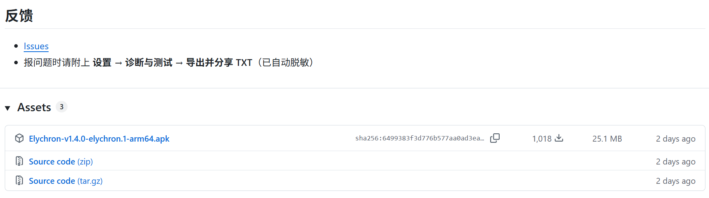
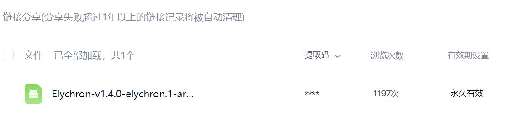
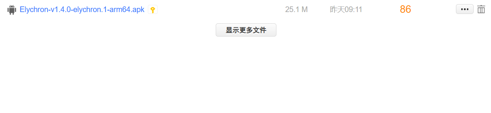

3. 路径时间预判功能加入（github issues #3）
4. “鸿蒙有救吗”——CC98@cptbtptp06

6. 
7. 
8. 给海宁同学询问课表：
他们校区的完整作息时间表：第 1 节到最后一节，每节的开始和结束时刻（截图、表格、抄一遍都行）。这是最核心的一份数据。
节次数量是否和紫金港一样是 13 节？如果海宁的节数不同、或者午休/晚课分段不一样，那我要把"节数"也做成可配置的，不能只换时间。
教务系统里那张课表长什么样（一张截图最好）：我要看教务显示的节次和时间，跟我们显示的对一下，才能确定差在哪 —— 这是最直接的证据。
是"整个校区统一"还是"每门课不一样"？我理解是校区统一，但确认一下。
会不会随学期/季节变（比如冬夏作息、寒暑假不同的上课时间）？
有没有课表导出文件（.ics，或者教务页面的 HTML 源码）？如果导出里带真实的上课时间，我可以直接对齐；如果里面只有节次，那就只能靠作息表。
9. 

